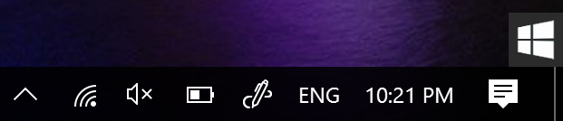
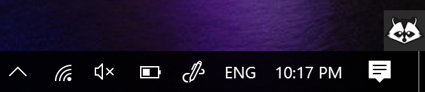
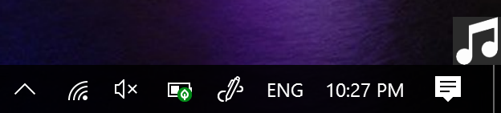

# Rocket

Custom hotkeys for Windows.

## Installation

- Install [AutoHotKey](https://autohotkey.com/)
- Double click on Rocket.ahk

## User Manual

To enable/disable Rocket

```
  Ctrl + .
```

**View when Rocket is disabled**



**View when Rocket is enabled**




## Commands

The comands can only be used when Rocket is enabled

**Put active window to Always On Top**

```
  Ctrl + Space
```

**Launch Terminal**

```
  Win + T
```

**Music Control**

```
  Win + M then p [Play/Pause]
  Win + M then left arrow [Previous song]
  Win + M then right arrow [Next song]
```

View when Music Control is enabled by pressing Win + M



## Add More Custom Commands
You can always customize the commands in Rocket.ahk
